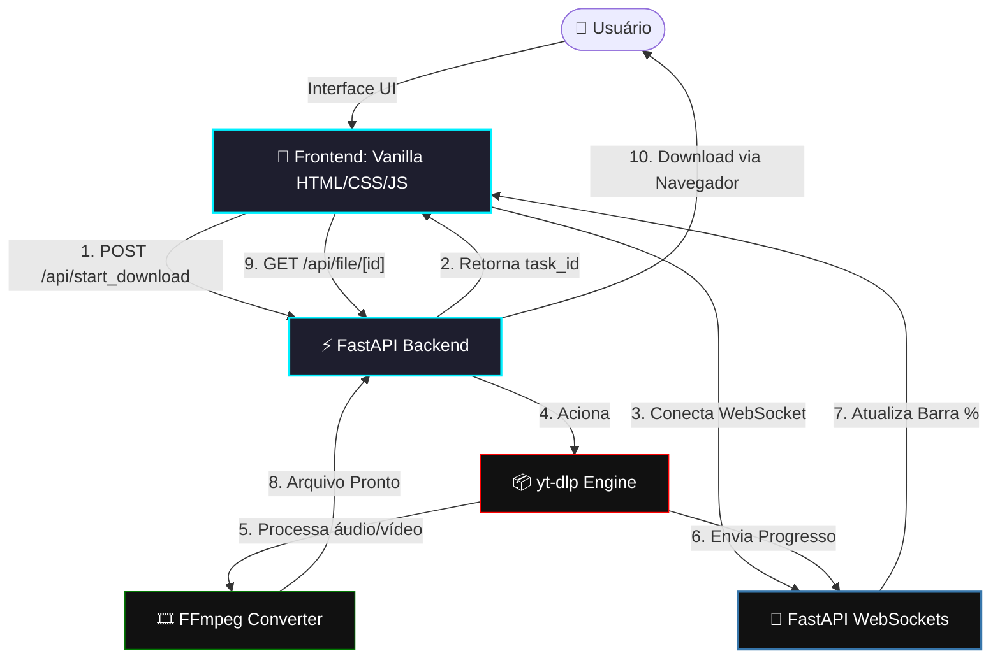

# 🎬 EasyDownload ⚡

<div align="center">
  
  [](#)
  [](#)
  [](#)
  [](#)
  [](#)
  [](#)
  
  <p align="center">
    <strong>Uma aplicação moderna, ultrarrápida e 100% segura para baixar vídeos e músicas em qualidade máxima.</strong>
  </p>
  
  <h3>Developed by Andrei Rodrigues</h3>
  
  <p align="center">
    <a href="https://www.linkedin.com/in/andreirdebarros/" target="_blank">
      
    </a>
    &nbsp;&nbsp;
    <a href="https://github.com/Andrei-RB" target="_blank">
      
    </a>
  </p>

</div>

---

## 📖 Sobre o Projeto

O **EasyDownload** é um ecossistema leve e autônomo (Self-Hosted) projetado para resolver um problema comum: baixar mídias da internet com velocidade máxima, qualidade sem perdas e total privacidade.

Ao contrário de serviços online repletos de anúncios invasivos e riscos de segurança, o **EasyDownload** roda localmente ou em seu servidor através de contêineres **Docker**, garantindo que seus dados nunca saiam da sua máquina. O design da interface foi inspirado nas tendências mais modernas do **Glassmorphism**, oferecendo uma experiência premium no modo escuro constante.

---

## ✨ Principais Funcionalidades

| Recurso | Detalhes | Status |
| :--- | :--- | :---: |
| 🎬 **MP4 Max Quality** | Downloads de vídeos na resolução máxima suportada com áudio acoplado via FFmpeg | `Disponível` |
| 🎵 **MP3 Max Quality** | Extração de áudio sem perdas com o maior bitrate disponível | `Disponível` |
| ⚡ **Progresso Real-Time** | Acompanhamento do download segundo a segundo com barra de progresso WebSocket | `Disponível` |
| 🎨 **Design Glassmorphic** | UI futurista e responsiva, dark mode nativo com gradientes neon customizados | `Disponível` |
| 🔒 **Segurança Blindada** | Bloqueio nativo contra inspeção de código (DevTools) e headers de segurança HTTP | `Disponível` |
| 🐳 **Docker Compose** | Inicialização em 5 segundos, sem necessidade de instalar dependências locais | `Disponível` |
| 🚀 **SaaS Core Ready** | Suporte nativo pré-configurado a Cloudflare Turnstile e limitador de taxa Redis | `Comentado / Pronto` |

---

## 🛠️ Arquitetura e Tecnologias Utilizadas

O projeto adota uma divisão limpa entre **Frontend** e **Backend**, otimizando a comunicação por meio de chamadas assíncronas e conexões em tempo real.



### Detalhamento da Stack:
* **Backend:** FastAPI (Python 3.13-slim). Rápido, assíncrono e de alto desempenho.
* **Processamento de Mídia:** `yt-dlp` integrado ao `FFmpeg` para fusão de faixas de alta qualidade de forma extremamente veloz.
* **Frontend:** Vanilla HTML5, CSS3 com variáveis customizadas para Glassmorphism e JavaScript Puro assíncrono.
* **Segurança:** Obfuscação básica e interceptores de teclas anti-DevTools no navegador, e isolamento em contêiner Docker rodando como usuário não-root (sem privilégios).
* **Containerização:** Docker & Docker Compose para portabilidade absoluta.

---

## 📂 Estrutura do Repositório

Aqui está uma visão organizada de como os arquivos do projeto estão estruturados:

```bash
EasyDownload/
├── .github/                   # Configurações do GitHub (ex: dependabot.yml)
├── backend/                   # Código-fonte do servidor FastAPI
│   ├── Dockerfile             # Dockerfile de produção com usuário não-root seguro
│   ├── main.py                # Ponto de entrada, WebSockets e APIs do Backend
│   └── requirements.txt       # Dependências Python (FastAPI, yt-dlp, uvicorn...)
├── dist/                      # Pasta contendo executáveis prontos (ex: DownloaderPro.exe)
├── frontend/                  # Aplicação web estática
│   ├── app.js                 # Lógica de conexão WebSocket, segurança DevTools e UI
│   ├── index.html             # Estrutura HTML5 com meta tags otimizadas para SEO
│   └── styles.css             # Folha de estilo futurista e responsiva (Dark Mode)
├── .gitignore                 # Arquivo de exclusão Git (otimizado para Python/IDE/Docker)
├── Dockerfile                 # Dockerfile raiz que une Frontend e Backend
└── docker-compose.yml         # Orquestração simplificada do serviço
```

---

## 🚀 Como Executar o Projeto

Graças ao Docker, você não precisa configurar o Python ou o FFmpeg em sua máquina física para rodar o projeto. Siga as instruções abaixo:

### Pré-requisitos
Certifique-se de ter instalado em seu computador:
* [Docker](https://www.docker.com/products/docker-desktop/)
* [Git](https://git-scm.com/)

---

### Passo a Passo

#### 1. Clonar o Repositório
Abra o seu terminal ou prompt de comando (PowerShell/CMD) e execute:
```bash
git clone https://github.com/Andrei-RB/EasyDownload.git
cd EasyDownload
```

#### 2. Iniciar a Aplicação com Docker Compose
Execute o seguinte comando para construir a imagem e iniciar o container:
```bash
docker compose up -d --build
```
> O parâmetro `-d` garante que os serviços rodem em segundo plano no seu terminal.

#### 3. Acessar a Interface Web
Uma vez inicializado com sucesso, abra o seu navegador de preferência e acesse:
```text
http://localhost:8000
```
*Cole o link de qualquer vídeo ou música e clique em **INICIAR DOWNLOAD** para testar! A barra de progresso será exibida em tempo real.*

#### 4. Parar a Aplicação
Se precisar interromper os contêineres a qualquer momento, execute:
```bash
docker compose down
```

---

## 💡 Prontidão para Produção (Modo SaaS)

Este projeto foi projetado com uma mente voltada ao mercado. Embora esteja configurado de fábrica para o uso livre local (Self-Hosted), todo o código-fonte de segurança e limitação comercial está pronto.

Para transformá-lo em uma plataforma de faturamento SaaS comercial pública:
1. **Ativar o Limite de Taxas:** Vá no arquivo [docker-compose.yml](./docker-compose.yml) e descomente a seção do banco de dados `Redis`. Em seguida, descomente a importação e ativação do `FastAPILimiter` no [main.py](./backend/main.py).
2. **Ativar Proteção Contra Bots:** Descomente o widget e o script do **Cloudflare Turnstile** no arquivo [index.html](./frontend/index.html) e no JavaScript [app.js](./frontend/app.js).

---

## 📱 Redes Sociais do Autor

Fique à vontade para entrar em contato, sugerir melhorias ou acompanhar outros projetos incríveis!

<table align="center">
  <tr>
    <td align="center">
      <a href="https://www.linkedin.com/in/andreirdebarros/" target="_blank">
        <br/>
        <b>Andrei Rodrigues no LinkedIn</b>
      </a>
    </td>
    <td align="center">
      <a href="https://github.com/Andrei-RB" target="_blank">
        <br/>
        <b>Andrei-RB no GitHub</b>
      </a>
    </td>
  </tr>
</table>

<div align="center">
  <sub>Criado com 💙 por Andrei Rodrigues</sub>
</div>
